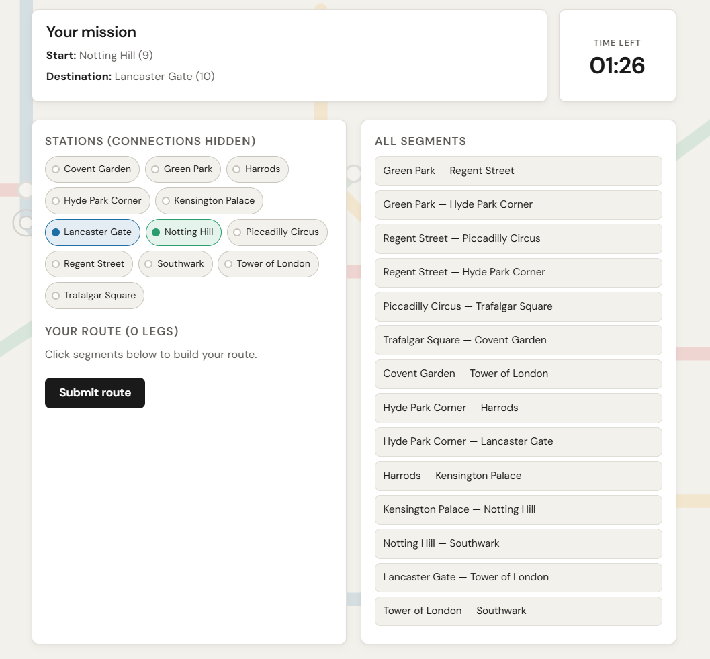
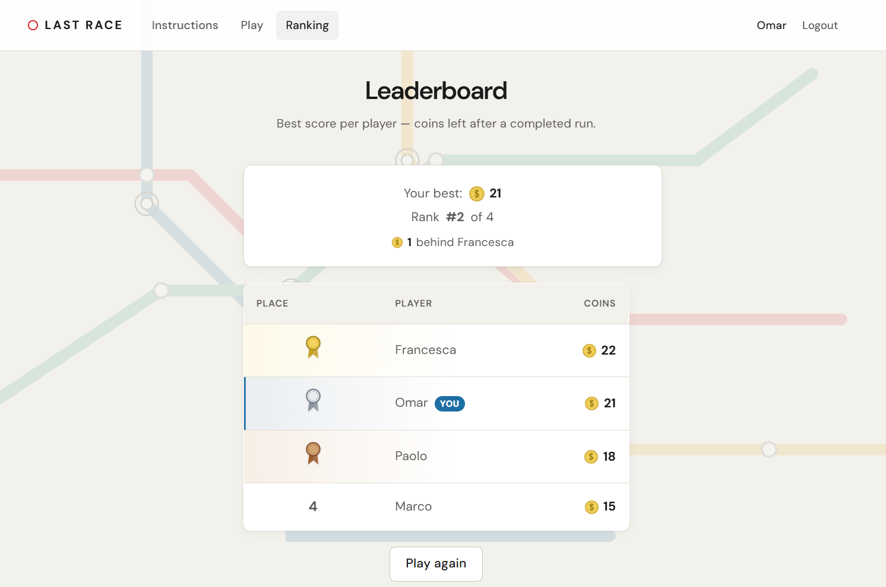

# Exam #1: "Last Race"

## Student: sXXXXXX LASTNAME FIRSTNAME

> **Before submit:** replace the line above with your matricola and name.

Metro route-planning game — Web Applications I 2025/26. React client (`localhost:5173`) + Express/SQLite API (`localhost:3001`), session cookies via Passport.

---

## React Client Application Routes

| Route | Access | Purpose |
|-------|--------|---------|
| `/` | Public | Game instructions and rules. **No map API** for anonymous users (exam requirement). |
| `/login` | Guest only | Login form; redirects to `/game` on success. |
| `/game` | Logged in | Full game flow: setup → planning (90s) → execution → result. |
| `/ranking` | Logged in | Leaderboard — best score per player from `GET /api/ranking`. |

Unknown paths redirect to `/`. Protected routes use `ProtectedRoute`; `/login` uses `GuestRoute`.

---

## API Server

Base URL: `http://localhost:3001` — all protected routes need session cookie (`credentials: 'include'`).

### Public

**`GET /api/health`**  
Response: `{ "ok": true }`

**`POST /api/sessions`** — login  
Body: `{ "username": "...", "password": "..." }`  
Success `201`: `{ "id": 1, "username": "Omar" }` + session cookie  
Failure `401`: `{ "error": "INVALID_CREDENTIALS" }`

**`GET /api/sessions/current`**  
Success `200`: user object · Failure `401`: `{ "error": "UNAUTHORIZED" }`

### Protected (login required)

**`DELETE /api/sessions/current`** — logout · `204` empty body

**`GET /api/network?view=full`** — setup map  
Response: `{ lines: [...], segments: [...] }` (lines with ordered stations + all segment pairs)

**`GET /api/network?view=planning`** — planning map  
Response: `{ stations: [...] }` (stations only, no line connections)

**`GET /api/segments`** — segment list for route builder  
Response: `{ segments: [{ fromId, toId, from, to }, ...] }`

**`POST /api/games`** — new game  
Success `201`: game object, `status: "setup"`

**`POST /api/games/:id/planning`** — start planning phase  
Success `200`: game with `start`, `destination`, `planningDeadline`, `status: "planning"`  
Errors: `404` not found · `409` invalid state

**`PUT /api/games/:id/route`** — submit route  
Body: `{ "segments": [[fromStationId, toStationId], ...] }`  
Success `200`: `{ valid, finalScore, steps? }` — invalid route → `valid: false`, `finalScore: 0`  
Errors: `404` · `409` (wrong state or planning expired)

**`GET /api/games/:id`** — game state (owner only)  
Success `200`: game object · `404` if not found or not owner

**`GET /api/ranking`** — leaderboard  
Success `200`: `[{ "username": "Omar", "bestScore": 22 }, ...]` sorted by score descending; only users with completed games

---

## Database Tables

| Table | Contents |
|-------|----------|
| `users` | Players: `username`, scrypt `password` + `salt` (no registration API) |
| `lines` | Metro line names (Red, Blue, Green, Yellow) |
| `stations` | Station names |
| `station_lines` | Station order on each line (defines adjacency) |
| `segments` | Undirected edges between adjacent stations (`station_a_id < station_b_id`) |
| `events` | Random events (`description`, `effect` from -4 to +4) |
| `games` | Play session: owner, start/dest, `route_json`, `planning_started_at`, `status`, `final_score` |
| `game_steps` | Per-leg log: from/to station, event, `coins_after` |

Full ER diagram and seed details: [`docs/LAST-RACE-DATABASE.md`](docs/LAST-RACE-DATABASE.md)

---

## Main React Components

| Component | File | Purpose |
|-----------|------|---------|
| `App` | `App.jsx` | Router, layout shell, route definitions |
| `Navbar` | `components/Navbar.jsx` | Header links; shows Play/Ranking when logged in |
| `AuthProvider` / `useAuth` | `auth/AuthContext.jsx` | Session state, login/logout API calls |
| `ProtectedRoute` | `components/ProtectedRoute.jsx` | Redirects guests to `/login` |
| `InstructionsPage` | `pages/InstructionsPage.jsx` | Public rules; no network fetch |
| `LoginPage` | `pages/LoginPage.jsx` | Login form |
| `GamePage` | `pages/GamePage.jsx` | Orchestrates game phases |
| `SetupPhase` | `components/game/SetupPhase.jsx` | Full map study + start planning |
| `PlanningPhase` | `components/game/PlanningPhase.jsx` | 90s timer, route builder, submit |
| `ExecutionPhase` | `components/game/ExecutionPhase.jsx` | Shows server steps one by one |
| `ResultPhase` | `components/game/ResultPhase.jsx` | Final score, play again |
| `RankingPage` | `pages/RankingPage.jsx` | Leaderboard table with medals |

API helpers: `api/client.js` (`apiFetch`), `api/gameApi.js` (game/network/ranking calls).

---

## Screenshot

Save captures in `img/` (see checklist below), then reference them here before tagging `final`:





---

## Screenshot checklist

Do this once before submission (browser at `http://localhost:5173`, both servers running):

1. **Start servers**
   - `cd server && npm install && nodemon index.js`
   - `cd client && npm install && npm run dev`
2. **Game screenshot** (`img/game-planning.png`)
   - Login as `Omar` / `password`
   - Go to **Play** → click **Start game** on setup
   - Capture **planning** phase: timer visible, start/destination shown, segment list on screen
   - Windows: `Win + Shift + S` → save as PNG in `img/`
3. **Ranking screenshot** (`img/ranking.png`)
   - Open **Ranking**
   - Capture table: Omar 1st (gold), Paolo 2nd, Francesca 3rd (bronze), Marco 4th; coin icons visible
4. **Update this README** — uncomment/fix image paths above if filenames differ
5. **Quick check** — log out: `/game` and `/ranking` must redirect to login

---

## Users Credentials

| Username | Password | Notes |
|----------|----------|--------|
| `Omar` | `password` | Best score **22** (seed) |
| `Paolo` | `password` | Best score **21** (seed) |
| `Francesca` | `password` | Best score **18** (seed) |
| `Marco` | `password` | Best score **15** (seed) |
| `Alice` | `password` | No completed games |
| `Giulia` | `password` | No completed games |

---

## How to run (grader)

```powershell
git clone <repo-url>
git checkout final
cd server
npm install
nodemon index.js
# new terminal:
cd client
npm install
npm run dev
```

Open `http://localhost:5173`.

**Verify scripts** (optional, in `server/`):  
`node verify-db.mjs` · `node verify-games.mjs` · `node verify-ranking.mjs` · `node run-test-http.mjs`

---

## Design choices (summary)

- Route submit uses **station IDs** in `PUT /route`; API responses include names.
- Each **segment at most once**; same station may repeat (exam 2026-06-05).
- **90s planning** enforced server-side (`planning_started_at`); client auto-submits at 0.
- Invalid route → score **0**, no execution animation.
- Negative totals stored and shown as **0**.
- No `GET /api/games` list; no user registration.

Details: [`docs/LAST-RACE-API-PLAN.md`](docs/LAST-RACE-API-PLAN.md)

---

## Use of AI Tools

<!-- Replace this block with your real statement before submit. Example: -->

I used Cursor (AI-assisted IDE) while building this project: clarifying exam requirements, drafting server route handlers and React phase components, and styling the client (Mini Metro–inspired theme). I reviewed and tested all generated code with the verify scripts (`verify-*.mjs`, `run-test-http.mjs`), manual play-through on `/game`, and by reading the logic before commits. Database design and final API shapes follow the official exam spec and course slides (Passport, scrypt, DAO pattern).

If you did **not** use AI tools, replace the paragraph above with: *I did not use AI tools for this project.*
