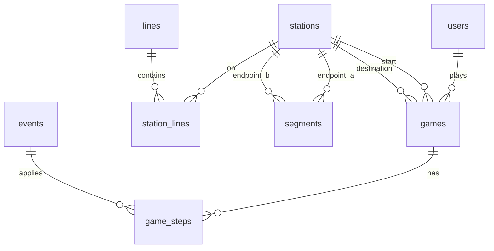

# Last Race — database design

Exam: **Web Applications I 2025/26 — Exam #1 “Last Race”**  
Branch: `dev`

This document is the reference for `server/schema.sql` and `server/seed.sql`. Business rules (route validation, scoring) are enforced in Express; the DB stores data and history.

**Route rules (exam 2026-06-05):** a valid route starts/ends at assigned stations; each leg exists on a line; line changes only at interchanges; **each undirected segment at most once**; the **same station may appear multiple times** (loops). See [LAST-RACE-API-PLAN.md](./LAST-RACE-API-PLAN.md) §7.

API response objects are built in DAOs using constructor functions in [`server/LastRaceModels.js`](../server/LastRaceModels.js) (WA1 / `QAModels.js` style).

---

## ER overview

---

## Tables

| Table | Purpose |
|--------|---------|
| `users` | Registered players (`username`, `password` + `salt` — scrypt, WA1 week05 style). No registration API — seed only. |
| `lines` | Metro lines (fixed network). |
| `stations` | Stops on the network. |
| `station_lines` | Which station belongs to which line and in what **order** (defines adjacency along the line). |
| `segments` | Undirected edge between two adjacent stations (`station_a_id` < `station_b_id`). Used for planning list and route validation. |
| `events` | Random event catalog (`description`, `effect` from -4 to +4). |
| `games` | One play session: owner, start/dest, optional `route_json`, `planning_started_at`, `status`, `final_score`. |
| `game_steps` | Per-leg execution log (from/to station, event, coins after step) for completed runs. |

**Derived (not stored):** interchange station = appears in more than one row in `station_lines` for different `line_id` values.

---

## Network (seed)

Fictional network inspired by the exam example (names are student-defined).

| Line | Stations (in order) |
|------|---------------------|
| **Red Line** | Centrale → Porta Velaria → Crocevia del Falco → Mercato Vecchio → Piazza delle Lanterne |
| **Blue Line** | Centrale → Fontana Oscura → Borgo Sereno → Colle Antico → Viale dei Mosaici |
| **Green Line** | Porta Velaria → Fontana Oscura → Stazione Lago → Torre Cinerea |
| **Yellow Line** | Piazza delle Lanterne → Torre Cinerea → Campo dell'Eco → Viale dei Mosaici |

**Counts (seed):** 4 lines, 12 stations, **6** interchange stations (≥3 required, ≤ half of 12).

**Interchange stations:** Centrale, Porta Velaria, Fontana Oscura, Piazza delle Lanterne, Torre Cinerea, Viale dei Mosaici.

**Not an interchange:** Campo dell'Eco (Yellow Line only).

**Segments:** one row per consecutive pair on each line (undirected, IDs stored with `station_a_id < station_b_id`).

---

## Events (seed)

At least 8 events; effects in [-4, +4].

| description | effect |
|-------------|--------|
| Quiet journey | 0 |
| Wrong platform | -2 |
| Kind passenger | +1 |
| Delay bonus | +2 |
| Lost ticket | -3 |
| Tourist tips | +3 |
| Signal failure | -4 |
| Lucky find | +4 |

---

## Users & sample games (seed)

| username | password | Notes |
|----------|----------|--------|
| `player1` | `password` | Two **completed** games (best score **21**) |
| `player2` | `password` | One **completed** game (score **22**) |
| `player3` | `password` | No completed games (for ranking contrast) |

`route_json` format: JSON array of `[fromStationId, toStationId]` integer pairs in travel order, e.g. `[[1,6],[6,7]]`. Names are resolved via `stations` when needed for display.

`planning_started_at`: ISO datetime set when the game enters `planning`; used with a 90s server deadline (see [LAST-RACE-API-PLAN.md](./LAST-RACE-API-PLAN.md)).

**Note:** Seed `route_json` uses station ID pairs (e.g. `[[1,6],[6,7]]`). `audit-seed.mjs` validates by ID.

---

## Game lifecycle (columns)

| `status` | Meaning |
|----------|---------|
| `setup` | Created; player viewing full map |
| `planning` | Start/dest assigned; building route |
| `execution` | Valid route submitted; steps being played |
| `completed` | Finished; `final_score` set (stored ≥ 0) |

---

## Ranking

Best score per user = `MAX(final_score)` over `games` where `status = 'completed'` and `user_id` matches.

---

## Initialization

On server start, `db.js` deletes `database.sqlite` (if present), applies `schema.sql`, then `seed.sql`, with `PRAGMA foreign_keys = ON`.

`database.sqlite` is gitignored; examiners recreate it via `npm install` + server start.
